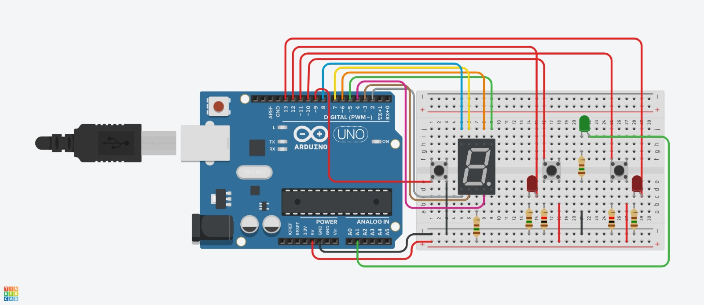

## Lógica Proposicional Aplicada a Circuitos

### Display de 7 segmentos com Arduino

Este projeto consiste em um circuito utilizando um Arduino para controlar um display de 7 segmentos e LEDs indicadores. O objetivo é mostrar um número no display e utilizar dois botões para realizar operações lógicas simples entre esses números, com o resultado exibido por meio de um LED verde.
[diagrama](public/diagrama_unifilar.pdf)

### [Materiais necessários](public/lista_de_materiais.csv)

## Funcionamento

O programa carregado no Arduino permite o controle do display de 7 segmentos e dos LEDs indicadores de acordo com as operações lógicas realizadas com os botões. Os botões permitem incrementar o número exibido no display e realizar operações lógicas entre dois números consecutivos. O resultado é mostrado por meio do LED verde.

## Pinagem

- O display de 7 segmentos é conectado aos pinos digitais 2 a 8 do Arduino.
- Os botões são conectados aos pinos digitais 9, 10 e 11 (BUTTON_1, BUTTON_2, BUTTON_3, respectivamente).
- Os LEDs indicadores são conectados aos pinos digitais 12 e 13 (LED_RED_1, LED_RED_2) e ao pino analógico A1 (LED_GREEN).

## Uso

1. Monte o circuito conforme a descrição da pinagem.
2. Faça o upload do código para o Arduino.
3. Pressione o botão BUTTON_1 para incrementar o número exibido no display.
4. Utilize os botões BUTTON_2 e BUTTON_3 para realizar operações lógicas entre os números exibidos.
5. Observe o resultado das operações no LED verde.